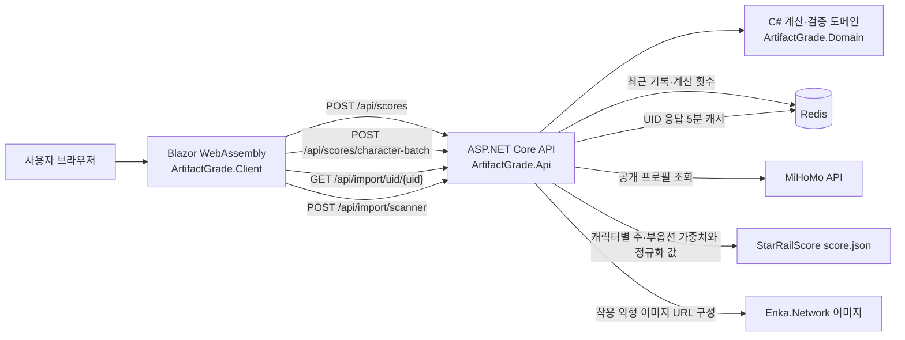

# 개척자의 유물 감정소

붕괴: 스타레일의 5성 유물을 UID 공개 프로필이나 HSR Scanner JSON에서 가져오고, 장착 캐릭터별 가중치를 자동 적용해 점수, 등급, 모든 스탯의 유효도를 보여주는 C# 웹 애플리케이션입니다.

> 게임의 공식 평가 기능이 아닌 참고용 도구입니다. 캐릭터별 가중치는 StarRailScore 공개 데이터를 실행 시 조회하며, 파티·광추·성혼·속도 구간까지 시뮬레이션하는 전투 점수는 아닙니다.

## 주요 기능

- UID 또는 Scanner JSON을 불러오면 선택 캐릭터의 장착 유물을 즉시 자동 계산
- 캐릭터 ID별 HP·공격력·방어력 스케일과 치명타·속도·격파·효과 명중 등 12개 부옵션 가중치 적용
- 카스토리스의 HP처럼 캐릭터마다 다른 HP·공격력·방어력 성장축을 별도 기준으로 평가
- 모든 부옵션을 `핵심`, `유효`, `보조`, `비유효`로 구분
- 주옵션 적합도와 12개 부옵션을 함께 반영한 총점, C~SSS 등급, 스탯별 가중치 및 기여도 표시
- Redis에 최근 20개 계산 기록과 전체 계산 횟수 저장
- Redis 장애 시 계산은 제공하고 저장 실패를 화면과 서버 로그에 명시
- UID 한 번으로 공개 프로필 캐릭터의 장착 유물 자동 불러오기
- HSR Scanner 버전 4 및 호환 JSON에서 전체 5성 유물 가져오기
- 선택 캐릭터가 착용한 외형의 전신 이미지를 왼쪽, 장착 유물 6개의 이미지와 옵션을 오른쪽에 한 번에 표시
- 가져온 유물의 주옵션 이름과 실제 계수, 부옵션, 점수를 카드에서 함께 표시
- 캐릭터 탭을 바꾸면 해당 캐릭터 기준으로 최대 300개씩 자동 재계산
- 평가 데이터가 없는 신규 캐릭터나 미장착 유물은 잘못된 범용 점수 대신 명시적인 안내 표시
- UID 응답을 Redis에 5분 동안 캐시하며 캐시 장애 시에도 외부 조회 계속 진행
- 데스크톱·모바일 반응형 UI

## 구성



| 프로젝트 | 책임 |
|---|---|
| `ArtifactGrade.Domain` | 유물 데이터, 입력 검증, 점수와 등급 계산 |
| `ArtifactGrade.Api` | HTTP 계약, MiHoMo·Scanner 변환, 캐릭터 가중치 조회, Redis 기록·UID 캐시, 장애 안내 |
| `ArtifactGrade.Client` | 자동 가져오기, 캐릭터 선택, 12개 옵션 유효도와 유물별 기여도 표시 |
| `ArtifactGrade.Domain.Tests`, `ArtifactGrade.Api.Tests` | xUnit 기반 계산·변환·캐시 회귀 테스트 |

## 필요 환경

- [.NET SDK 10](https://dotnet.microsoft.com/download/dotnet/10.0)
- 선택 사항: Redis 7 이상 또는 Docker Desktop

Redis와 Docker를 모두 설치하지 않아도 UID 불러오기, JSON 불러오기와 캐릭터별 자동 계산을 사용할 수 있습니다. 이 경우 최근 계산 저장, UID 캐시와 가중치 영구 캐시만 실패 경고를 남기고 생략합니다. UID 조회, 이미지와 API 프로세스 최초 실행 시 캐릭터별 가중치 조회에는 인터넷 연결이 필요합니다.

## 가장 빠른 실행 방법 - Docker 없음

먼저 저장소 루트에서 패키지를 복원합니다.

```powershell
dotnet restore ArtifactGrade.slnx --configfile NuGet.Config
```

그다음 파일 탐색기에서 저장소 루트의 `start-dev.cmd`를 더블클릭합니다. API와 클라이언트가 각각 `dotnet watch`로 실행되고, 화면 준비가 끝나면 <http://localhost:5111>이 자동으로 열립니다. 이미 서버가 실행 중이면 중복으로 실행하지 않고 화면만 엽니다.

개발 중에는 코드를 저장하면 자동으로 다시 빌드하고 반영합니다. 즉시 전체 재시작이 필요하면 해당 실행 창에서 `Ctrl+R`, 종료할 때는 `Ctrl+C`를 누릅니다. 평소에는 PowerShell을 닫고 다시 켤 필요가 없습니다.

명령어를 직접 실행하려면 첫 번째 터미널에서 API를 실행합니다.

```powershell
dotnet watch --project src/ArtifactGrade.Api run
```

두 번째 터미널에서 클라이언트를 실행합니다.

```powershell
dotnet watch --project src/ArtifactGrade.Client run
```

브라우저에서 <http://localhost:5111>로 접속합니다. Redis 연결 경고는 예상된 동작이며 계산과 자동 가져오기는 계속 사용할 수 있습니다.

## Redis 사용 - 선택 사항

로컬 Redis가 이미 실행 중이라면 `src/ArtifactGrade.Api/appsettings.json`의 `ConnectionStrings:Redis`에 주소를 설정합니다. Redis를 연결하면 최근 계산 20개, 누적 계산 횟수, UID 응답 5분 캐시와 캐릭터 평가 원본 30일 캐시를 사용할 수 있습니다.

Docker Desktop이 있는 환경에서 Client, API, Redis를 한 번에 실행하려면 다음 명령을 사용합니다.


```powershell
docker compose up --build
```

- 웹 화면: <http://localhost:8080>
- API 상태: <http://localhost:5072/api/health>

```powershell
docker compose down
```

Redis 데이터는 `artifact-grade-redis` Docker 볼륨에 유지됩니다.

## 사용법

### UID로 장착 유물 자동 불러오기

1. 게임에서 프로필 편집 화면을 열고 확인할 캐릭터와 유물을 공개합니다.
2. 화면 위쪽 `UID 공개 프로필`에 숫자 9자리 UID를 입력합니다.
3. `UID 불러오기`를 누릅니다.
4. `캐릭터별 보기`에서 확인할 캐릭터 탭을 누릅니다.
5. 왼쪽에서 현재 캐릭터가 착용한 외형의 전신 이미지를 보고, 오른쪽에서 장착 유물 최대 6개의 이미지와 옵션을 한 번에 확인합니다.
6. 각 유물 카드의 `주옵션 계수`에서 `치명타 피해 64.8%`, `속도 25.03` 같은 실제 수치와 `핵심·유효·보조·비유효`, 가중치, 점수 기여도를 확인합니다.
7. 별도 버튼을 누르지 않아도 주옵션과 부옵션을 합친 선택 캐릭터 전용 점수와 등급이 자동 표시됩니다.
8. `캐릭터 유효 옵션 전체`에서 12개 부옵션의 가중치와 `핵심·유효·보조·비유효` 판정을 확인합니다.
9. 각 유물 카드에서는 실제 부옵션마다 같은 판정, 가중치와 점수 기여도를 확인합니다. 캐릭터 탭을 바꾸면 새 캐릭터 기준으로 즉시 다시 계산합니다.
10. UID 방식은 공개 프로필에 전시된 최대 8명 캐릭터의 장착 유물만 조회합니다.

UID 조회는 MiHoMo 공개 API를 사용합니다. HoYoLAB 로그인 정보, 쿠키 또는 토큰은 입력받지 않습니다. 외부 서비스 보호를 위해 UID 조회 API는 호출자 IP별로 1분에 10회까지 허용하며, 형식이 잘못된 UID는 제한 횟수에 포함하지 않습니다.

유물과 기본 캐릭터 이미지는 MiHoMo parsed 응답의 `icon`, `portrait` 경로를 StarRailRes 원본 주소에 연결해 표시합니다. 캐릭터가 별도 외형을 착용했다면 MiHoMo 원본 응답의 `dressedSkinId`를 읽어 Enka의 해당 외형 전신 이미지를 우선 표시합니다. 외형 정보 조회나 이미지 로드가 실패하면 가져오기 전체를 중단하지 않고 기본 캐릭터 이미지로 자동 전환하며, 캐릭터 캡션에 전환 이유를 표시합니다. 이미지 표시에는 인터넷 연결이 필요합니다.

### HSR Scanner JSON으로 전체 인벤토리 가져오기

1. [HSR Scanner](https://github.com/kel-z/HSR-Scanner)를 안내에 따라 실행하고 버전 4 JSON을 생성합니다.
2. 화면 위쪽 `전체 인벤토리 JSON`에서 생성한 `.json` 파일을 선택합니다.
3. `캐릭터별 보기`에서 장착 캐릭터를 선택합니다. 장착 캐릭터가 없는 유물은 `미장착` 탭에 모입니다.
4. 선택 즉시 캐릭터별 평가 기준과 점수가 자동 표시됩니다. 프로필을 고르거나 수치를 다시 입력할 필요가 없습니다.
5. 카드에서 각 유물의 주옵션 계수, 부옵션 유효도, 가중치와 점수 기여도를 함께 확인합니다.
6. 파일은 최대 10MB이며 API가 변환한 뒤 원본 JSON을 저장하지 않습니다.

HSR Scanner 버전 4에는 이미지 경로가 없지만 캐릭터 `id`와 유물 `set_id`가 있으므로 StarRailRes 이미지 주소로 변환합니다. 오래된 호환 파일처럼 ID가 빠진 항목만 이미지 자리에 안내 표시가 나옵니다. 주옵션 계수는 5성 유물의 주옵션 기본값과 강화 단계별 증가량으로 계산해 표시합니다.

HSR Scanner와 Reliquary Archiver는 HoYoverse 공식 도구가 아닙니다. 외부 도구 사용 여부는 각 프로젝트 안내를 확인한 뒤 결정하세요.

## 점수 계산 방식

100점 기준에서 주옵션과 부옵션에 각각 50%를 배정합니다. 주옵션은 +15일 때 해당 부위의 캐릭터 가중치만큼 50점을 받고, 강화가 덜 됐다면 레벨에 비례합니다. 부옵션은 실제 5성 롤의 횟수와 품질을 `1.0·1.1·1.2` 단위로 복원한 뒤 캐릭터별 `max`로 정규화합니다.

```text
주옵션 점수 = (유물 레벨 + 1) ÷ 16 × 주옵션 가중치 × 50
부옵션 롤 단위 = 기본 롤 횟수 + 품질 상승 단계 수 × 0.1
부옵션 기여도 = 부옵션 롤 단위 × 부옵션 가중치 × (50 ÷ 캐릭터 max)
총점 = 주옵션 점수 + 모든 부옵션 기여도의 합
```

예를 들어 카스토리스는 HP%·치명타 확률·치명타 피해 가중치가 `1.0`, 공격력%는 `0`입니다. 같은 수치의 공격력%는 점수에 더하지 않으며, HP를 쓰는 주옵션은 해당 부위의 원본 가중치에 따라 별도 점수를 받습니다. `max`는 여섯 부위의 이론 최고 부옵션 원점수 평균이므로, 특정 부위의 점수는 주옵션과 겹치는 부옵션 구성에 따라 100점을 조금 넘을 수도 있습니다.

| 등급 | 점수 |
|---|---:|
| SSS | 97 이상 |
| SS | 90 이상 |
| S | 80 이상 |
| A | 70 이상 |
| B | 60 이상 |
| C | 60 미만 |

이 구간은 주옵션 50점과 부옵션 50점을 합산하는 캐릭터 자동 평가용입니다. 공개 UID `800333171`의 48개 유물을 기준으로 기존 구간에서 SS 이상이 46개였던 쏠림을 확인한 뒤, 새 구간에서는 SSS 2개·SS 13개가 되도록 조정했습니다. 호환성을 위해 남겨 둔 기존 수동 점수 API의 등급 구간은 변경하지 않았습니다.

롤 복원과 계산식은 [RelicScoring.cs](src/ArtifactGrade.Domain/RelicScoring.cs), 캐릭터 분류와 유효도 구간은 [CharacterScoring.cs](src/ArtifactGrade.Domain/CharacterScoring.cs)에서 확인할 수 있습니다. 캐릭터별 원본은 재현 가능한 결과를 위해 [StarRailScore `score.json`의 고정 커밋](https://github.com/Mar-7th/StarRailScore/blob/fb8268bc6345c52501bd4ec23f8df89b26497e0a/score.json)을 조회하며, 롤 단위와 `max` 생성 방식도 [같은 커밋의 생성 스크립트](https://github.com/Mar-7th/StarRailScore/blob/fb8268bc6345c52501bd4ec23f8df89b26497e0a/scripts/generate.py#L213-L248)에 맞췄습니다. 검증한 결과는 API 프로세스 메모리에 재사용하고 원본 JSON은 Redis에 30일 보관해 일시적인 원격 장애 때 대체합니다. 원본에 없는 캐릭터는 임의 프로필로 계산하지 않습니다.

## Redis 저장 구조

| 키 | 형식 | 내용 |
|---|---|---|
| `artifact-grade:calculations:recent` | List | 최신 계산 20개 JSON 기록 |
| `artifact-grade:calculations:count` | String/Integer | 정상 계산 누적 횟수 |
| `artifact-grade:imports:uid:{UID-SHA256}` | String | MiHoMo parsed 응답과 착용 외형 ID를 병합한 JSON, 5분 뒤 자동 만료 |
| `artifact-grade:profiles:starrailscore:{source-commit}` | String | 고정 커밋의 캐릭터 평가 원본 JSON, 30일 뒤 자동 만료 |

Redis가 연결되지 않아도 점수 계산 API는 `200 OK`와 계산 결과를 반환합니다. 이때 `redisSaved`는 `false`이며 `warning`에 저장 실패가 표시됩니다. 연결 상태는 `/api/health`에서 확인할 수 있습니다.

## 테스트와 빌드

전체 자동화 테스트:

```powershell
dotnet test ArtifactGrade.slnx -c Release --no-restore --disable-build-servers
```

도메인 테스트:

```powershell
dotnet test tests/ArtifactGrade.Domain.Tests/ArtifactGrade.Domain.Tests.csproj
```

전체 빌드:

```powershell
dotnet build ArtifactGrade.slnx
```

API를 실행한 상태에서 스모크 테스트:

```powershell
powershell -ExecutionPolicy Bypass -File tests/api-smoke.ps1
```

Docker 없이 Scanner JSON 가져오기와 일괄 계산 테스트:

```powershell
powershell -ExecutionPolicy Bypass -File tests/import-smoke.ps1
```

실제 공개 UID 조회까지 확인하려면 본인 UID를 추가합니다.

```powershell
powershell -ExecutionPolicy Bypass -File tests/import-smoke.ps1 -Uid 123456789
```

Docker Compose 전체를 실행한 상태에서 Redis 저장·최근 20개 제한·누적 횟수 통합 테스트:

```powershell
powershell -ExecutionPolicy Bypass -File tests/redis-integration.ps1
```

GitHub Actions도 푸시와 Pull Request마다 복원, 테스트, Release 빌드를 실행합니다.

## 배포 설정

- 로컬 개발 API 주소: `src/ArtifactGrade.Client/wwwroot/appsettings.Development.json`의 `ApiBaseUrl`
- Docker 클라이언트는 Nginx가 같은 출처의 `/api` 요청을 API 컨테이너로 전달하므로 외부 주소를 다시 빌드할 필요가 없습니다.
- API Redis 주소: 환경 변수 `ConnectionStrings__Redis`
- 캐릭터 가중치 원본 주소: `StarRailScore__BaseUrl` (기본값은 검증한 GitHub 커밋에 고정)
- 허용할 클라이언트 출처: `ClientOrigins__0`, `ClientOrigins__1` 형식의 환경 변수
- 신뢰할 리버스 프록시 네트워크: `ForwardedHeaders__KnownNetworks__0` 형식의 CIDR. Compose는 전용 `172.30.0.0/24` 네트워크만 신뢰합니다.
- HTTPS는 운영 환경의 리버스 프록시 또는 호스팅 플랫폼에서 종료하는 구성을 전제로 합니다.

Redis가 필요하므로 GitHub Pages만으로 전체 서비스를 배포할 수 없습니다. Blazor 정적 파일, ASP.NET Core API, Redis를 함께 제공할 수 있는 Docker 지원 호스팅을 사용합니다.
Compose의 API 개발 포트와 Redis 포트는 로컬 컴퓨터(`127.0.0.1`)에만 열립니다. 외부 사용자는 Nginx를 통해 접근하며, API는 신뢰된 Docker 네트워크가 전달한 실제 호출자 IP를 기준으로 UID 요청을 제한합니다. 운영 환경에서는 외부 Redis 포트를 공개하지 말고 Docker 내부 네트워크로만 연결합니다.

## 디렉터리 구조

```text
src/
  ArtifactGrade.Domain/
  ArtifactGrade.Api/
  ArtifactGrade.Client/
tests/
  ArtifactGrade.Domain.Tests/
  ArtifactGrade.Api.Tests/
  api-smoke.ps1
  import-smoke.ps1
  redis-integration.ps1
docs/
  DEVELOPMENT_PLAN.md
  BLOG_POST_DRAFT.md
  research/AUTOMATIC_RELIC_IMPORT.md
  research/CHARACTER_RELIC_WEIGHTS.md
  research/CHARACTER_APPEARANCE.md
.github/workflows/ci.yml
docker-compose.yml
```

## 알려진 제한사항

- 5성 유물만 평가합니다.
- 캐릭터별 주·부옵션 가중치는 전형적인 세팅의 비교 기준이며 파티, 광추, 성혼, 속도·효과 명중 목표 구간에 따른 비선형 가치는 계산하지 않습니다.
- StarRailScore 원본에 아직 등록되지 않은 신규 캐릭터는 점수를 표시하지 않습니다.
- UID 가져오기는 공개 프로필에 전시된 캐릭터의 장착 유물만 지원합니다.
- 전체 인벤토리 가져오기는 HSR Scanner 버전 4 호환 JSON이 필요합니다.
- 이미지 직접 인식은 아직 지원하지 않습니다.
- Redis가 설치되지 않은 개발 환경에서는 저장 실패 경고가 정상적으로 표시됩니다.

## 데이터 출처

- [Honkai: Star Rail Wiki - Relic Stats](https://honkai-star-rail.fandom.com/wiki/Relic/Stats)
- [HoYoLAB - What are Relics?](https://www.hoyolab.com/article/16076157)
- [MiHoMo Parsed Data API](https://march7th.xyz/en/api/parsed.html)
- [HSR Scanner JSON 형식](https://github.com/kel-z/HSR-Scanner/blob/main/README.md)
- [StarRailScore 캐릭터별 주·부옵션 가중치 — 적용 커밋](https://github.com/Mar-7th/StarRailScore/blob/fb8268bc6345c52501bd4ec23f8df89b26497e0a/score.json)
- [Fribbels Stat Score — 가중치 방식과 한계](https://github.com/fribbels/hsr-optimizer/blob/main/docs/guides/en/stat-score.md)

5성 유물의 부옵션이 3레벨마다 추가 또는 강화된다는 규칙과 세 단계 증가량을 교차 확인했습니다. 프로젝트는 그중 최고 증가량으로 입력값을 정규화합니다.

## 개발 기록

기술 선택, 구현 과정, 테스트 결과, 트러블슈팅, 평가 항목 상태는 [개발 계획 및 기록](docs/DEVELOPMENT_PLAN.md)에 누적합니다.
게시할 때 사용할 소개 글은 [개발 블로그 초안](docs/BLOG_POST_DRAFT.md)에 준비했습니다.

## 라이선스

[MIT License](LICENSE)
