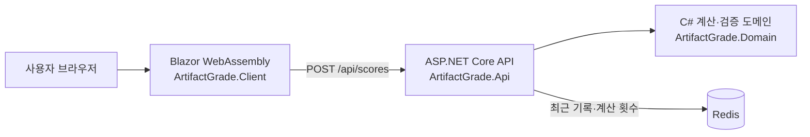

# 개척자의 유물 감정소

붕괴: 스타레일의 5성 유물 부옵션을 입력하면 육성 프로필별 가중치를 적용해 점수, 등급, 스탯별 기여도를 보여주는 C# 웹 애플리케이션입니다.

> 게임의 공식 평가 기능이 아닌 참고용 도구입니다. 유물 부옵션 증가량은 공개 자료를 사용하고, 프로필별 가중치와 등급 구간은 이 프로젝트에서 정의한 평가 기준입니다.

## 주요 기능

- 치명타, 공격력, HP, 방어력, 격파, 서포터의 6개 평가 프로필
- 유물 부위에 따라 선택 가능한 주옵션 제한
- 최대 4개 부옵션과 강화 단계 입력
- 중복 부옵션, 음수, 강화 단계별 최대치, 잘못된 부위·주옵션 조합 검증
- 총점과 C~SSS 등급, 스탯별 가중치 및 기여도 표시
- 최근 입력 브라우저 저장, 전체 초기화, 결과 텍스트 복사
- Redis에 최근 20개 계산 기록과 전체 계산 횟수 저장
- Redis 장애 시 계산은 제공하고 저장 실패를 화면과 서버 로그에 명시
- 데스크톱·모바일 반응형 UI

## 구성



| 프로젝트 | 책임 |
|---|---|
| `ArtifactGrade.Domain` | 유물 데이터, 입력 검증, 점수와 등급 계산 |
| `ArtifactGrade.Api` | HTTP 계약, Redis 기록, Redis 장애 안내 |
| `ArtifactGrade.Client` | 입력 UI, 결과 표시, 브라우저 저장과 복사 |
| `ArtifactGrade.Domain.Tests` | xUnit 기반 계산·검증 회귀 테스트 |

## 필요 환경

- [.NET SDK 10](https://dotnet.microsoft.com/download/dotnet/10.0)
- Redis 7 이상 또는 Docker Desktop

Docker를 사용하지 않는 경우 실행 중인 Redis 주소를 `src/ArtifactGrade.Api/appsettings.json`의 `ConnectionStrings:Redis`에 설정합니다.

## 가장 빠른 실행 방법

Docker가 설치되어 있다면 저장소 루트에서 다음 명령을 실행합니다.

```powershell
docker compose up --build
```

- 웹 화면: <http://localhost:8080>
- API 상태: <http://localhost:5072/api/health>

종료할 때는 다음 명령을 사용합니다.

```powershell
docker compose down
```

Redis 데이터는 `artifact-grade-redis` Docker 볼륨에 유지됩니다.

## 로컬 개발 실행

### 1. 패키지 복원

```powershell
dotnet restore ArtifactGrade.slnx --configfile NuGet.Config
```

### 2. Redis 실행

```powershell
docker compose up -d redis
```

### 3. API 실행

첫 번째 터미널에서 실행합니다.

```powershell
dotnet run --project src/ArtifactGrade.Api
```

기본 주소는 `http://localhost:5072`입니다.

### 4. Blazor 클라이언트 실행

두 번째 터미널에서 실행합니다.

```powershell
dotnet run --project src/ArtifactGrade.Client
```

브라우저에서 `http://localhost:5111`로 접속합니다.

## 사용법

1. 장착할 캐릭터의 성장 방식과 가까운 평가 프로필을 선택합니다.
2. 유물 부위를 고른 뒤 게임에 표시된 주옵션을 선택합니다.
3. 현재 강화 단계와 부옵션 종류를 선택합니다.
4. 퍼센트 기호를 제외한 숫자만 입력합니다. 예: 치명타 확률 `6.4%`는 `6.4`로 입력합니다.
5. `유물 점수 계산하기`를 누릅니다.
6. 총점과 등급뿐 아니라 스탯별 가중치와 기여도를 함께 확인합니다.

주옵션은 존재 가능한 유물 조합과 동일 부옵션 여부를 검증하는 데 사용합니다. 현재 점수는 부옵션 효율만 나타냅니다.

## 점수 계산 방식

각 부옵션은 5성 유물에서 가능한 최고 1회 증가량을 기준으로 환산합니다.

```text
스탯 기여도 = 입력 수치 ÷ 해당 스탯 최고 1회 증가량 × 프로필 가중치 × 10
총점 = 스탯 기여도 합계
```

예를 들어 치명타 프로필에서 치명타 확률 `6.48%`는 최고 증가량 `3.24%`의 2회분이므로 `20점`입니다.

| 등급 | 점수 |
|---|---:|
| SSS | 75 이상 |
| SS | 65 이상 |
| S | 55 이상 |
| A | 45 이상 |
| B | 35 이상 |
| C | 35 미만 |

가중치와 최고 증가량은 [RelicScoring.cs](src/ArtifactGrade.Domain/RelicScoring.cs)에서 확인할 수 있습니다. 숫자를 변경할 때는 기존 샘플 유물의 결과가 바뀌는지 반드시 테스트합니다.

## Redis 저장 구조

| 키 | 형식 | 내용 |
|---|---|---|
| `artifact-grade:calculations:recent` | List | 최신 계산 20개 JSON 기록 |
| `artifact-grade:calculations:count` | String/Integer | 정상 계산 누적 횟수 |

Redis가 연결되지 않아도 점수 계산 API는 `200 OK`와 계산 결과를 반환합니다. 이때 `redisSaved`는 `false`이며 `warning`에 저장 실패가 표시됩니다. 연결 상태는 `/api/health`에서 확인할 수 있습니다.

## 테스트와 빌드

도메인 테스트:

```powershell
dotnet test tests/ArtifactGrade.Domain.Tests/ArtifactGrade.Domain.Tests.csproj
```

전체 빌드:

```powershell
dotnet build ArtifactGrade.slnx
```

API를 실행한 상태에서 스모크 테스트:

```powershell
powershell -ExecutionPolicy Bypass -File tests/api-smoke.ps1
```

Docker Compose 전체를 실행한 상태에서 Redis 저장·최근 20개 제한·누적 횟수 통합 테스트:

```powershell
powershell -ExecutionPolicy Bypass -File tests/redis-integration.ps1
```

GitHub Actions도 푸시와 Pull Request마다 복원, 테스트, Release 빌드를 실행합니다.

## 배포 설정

- 로컬 개발 API 주소: `src/ArtifactGrade.Client/wwwroot/appsettings.Development.json`의 `ApiBaseUrl`
- Docker 클라이언트는 Nginx가 같은 출처의 `/api` 요청을 API 컨테이너로 전달하므로 외부 주소를 다시 빌드할 필요가 없습니다.
- API Redis 주소: 환경 변수 `ConnectionStrings__Redis`
- 허용할 클라이언트 출처: `ClientOrigins__0`, `ClientOrigins__1` 형식의 환경 변수
- HTTPS는 운영 환경의 리버스 프록시 또는 호스팅 플랫폼에서 종료하는 구성을 전제로 합니다.

Redis가 필요하므로 GitHub Pages만으로 전체 서비스를 배포할 수 없습니다. Blazor 정적 파일, ASP.NET Core API, Redis를 함께 제공할 수 있는 Docker 지원 호스팅을 사용합니다.
Compose의 Redis 호스트 포트는 로컬 컴퓨터(`127.0.0.1`)에만 열립니다. 운영 환경에서는 외부 Redis 포트를 공개하지 말고 Docker 내부 네트워크로만 연결합니다.

## 디렉터리 구조

```text
src/
  ArtifactGrade.Domain/
  ArtifactGrade.Api/
  ArtifactGrade.Client/
tests/
  ArtifactGrade.Domain.Tests/
  api-smoke.ps1
  redis-integration.ps1
docs/
  DEVELOPMENT_PLAN.md
  BLOG_POST_DRAFT.md
.github/workflows/ci.yml
docker-compose.yml
```

## 알려진 제한사항

- 5성 유물만 평가합니다.
- 캐릭터별 세부 목표 수치 대신 6개 범용 육성 프로필을 사용합니다.
- 주옵션의 캐릭터 적합도는 아직 점수에 포함하지 않습니다.
- 이미지 인식과 UID 자동 불러오기는 지원하지 않습니다.
- Redis가 설치되지 않은 개발 환경에서는 저장 실패 경고가 정상적으로 표시됩니다.

## 데이터 출처

- [Honkai: Star Rail Wiki - Relic Stats](https://honkai-star-rail.fandom.com/wiki/Relic/Stats)
- [HoYoLAB - What are Relics?](https://www.hoyolab.com/article/16076157)

5성 유물의 부옵션이 3레벨마다 추가 또는 강화된다는 규칙과 세 단계 증가량을 교차 확인했습니다. 프로젝트는 그중 최고 증가량으로 입력값을 정규화합니다.

## 개발 기록

기술 선택, 구현 과정, 테스트 결과, 트러블슈팅, 평가 항목 상태는 [개발 계획 및 기록](docs/DEVELOPMENT_PLAN.md)에 누적합니다.
게시할 때 사용할 소개 글은 [개발 블로그 초안](docs/BLOG_POST_DRAFT.md)에 준비했습니다.

## 라이선스

[MIT License](LICENSE)
