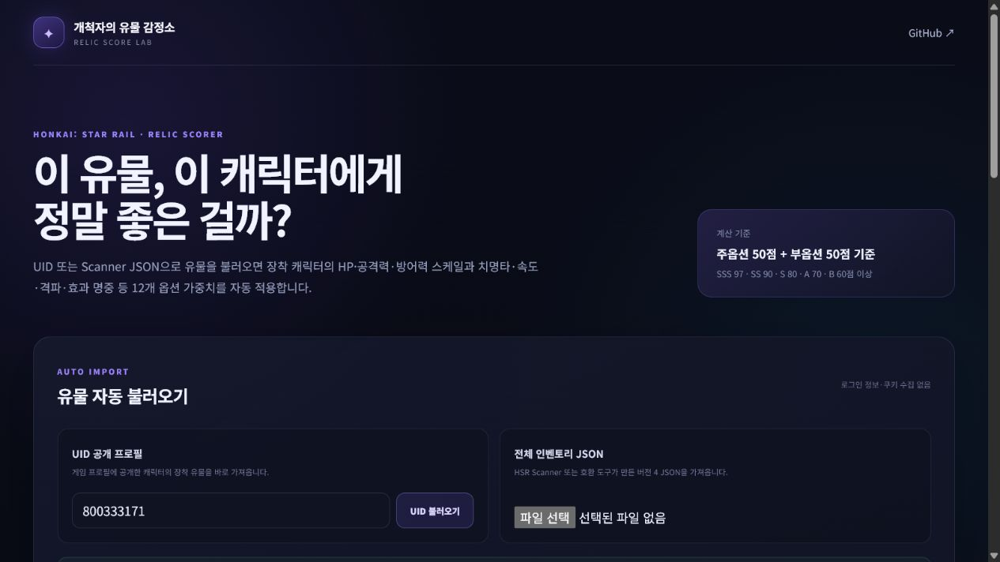
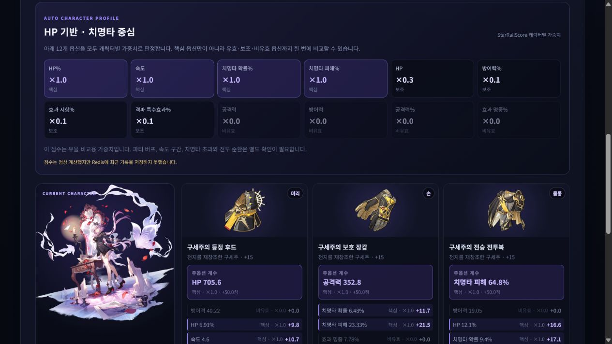
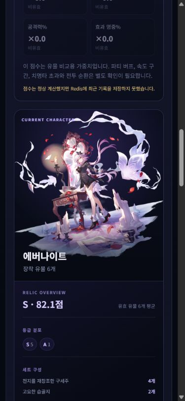

# C#과 Redis로 만든 붕괴: 스타레일 유물 점수 계산기

> 게시 전 체크: 데스크톱·모바일 화면 캡처는 첨부 완료했다. 실제 배포 주소를 넣고, 게시한 뒤 `DEVELOPMENT_PLAN.md`의 평가 항목 5와 게시 링크를 갱신한다.

## 만들게 된 이유

붕괴: 스타레일에서 유물을 비교할 때 치명타 수치만 보면 속도나 효과 명중처럼 캐릭터마다 중요한 부옵션을 놓치기 쉽다. 카스토리스는 치명타 딜러이면서 공격력이 아니라 HP로 피해가 증가하므로 범용 `치명타 딜러` 점수도 충분하지 않았다. 그래서 UID나 Scanner JSON으로 유물을 가져오면 장착 캐릭터별 12개 옵션 가중치를 자동 적용하고, 총점뿐 아니라 각 스탯이 몇 점을 기여했는지 보여주는 도구를 만들었다.

프로젝트 이름은 **개척자의 유물 감정소**다. 게임의 공식 평가 기능은 아니며, 공개된 5성 유물 증가량과 StarRailScore의 캐릭터별 가중치를 사용하는 참고용 계산기다.







## 구현한 기능

- 장착 캐릭터 ID별 12개 부옵션 가중치 자동 적용
- HP·공격력·방어력 기반 치명타, 격파, 효과 명중, 지원 유형 자동 요약
- 모든 옵션을 핵심·유효·보조·비유효로 구분
- 주옵션 적합도와 12개 부옵션을 합친 C~SSS 등급, 실제 수치·가중치·점수 기여도 표시
- Redis에 최근 20개 계산과 전체 계산 횟수 저장
- Redis 장애 시 계산은 유지하고 저장 실패는 사용자와 서버 로그에 알림
- UID만 입력해 공개 프로필의 장착 유물 자동 불러오기
- HSR Scanner 버전 4 JSON으로 전체 5성 유물 가져오기
- 가져오기 직후와 캐릭터 탭 전환 시 자동 점수 계산
- 장착 캐릭터별 탭과 캐릭터별 유물·점수 필터
- 왼쪽의 캐릭터 착용 외형 전신 이미지와 오른쪽의 장착 유물 6개를 한 화면에 배치
- 일러스트 아래에 평균 점수, 등급 분포, 세트 구성, 핵심 주옵션 수, 교체 우선 유물과 핵심 부옵션 기여 합계를 요약
- 유물 이미지, 주옵션 실제 계수, 부옵션과 계산 점수를 카드에 함께 표시
- Redis에 UID 응답을 5분 캐시하고 Redis가 없어도 가져오기 계속 진행
- 모바일 반응형 화면

## 기술 구성

화면은 Blazor WebAssembly, 서버는 ASP.NET Core Minimal API, 계산 규칙은 별도 C# Domain 프로젝트로 나눴다. Redis는 점수 계산 자체의 필수 의존성이 아니라 최근 사용 기록을 담당한다. 따라서 Redis가 잠시 중단돼도 사용자는 점수를 받을 수 있고, 저장 실패는 숨기지 않는다.

테스트는 xUnit으로 계산식과 주요 검증 규칙을 확인한다. Docker Compose에는 Client, API, Redis를 함께 정의했고 GitHub Actions는 복원, 전체 테스트, Release 빌드를 수행한다. Docker가 없는 PC에서도 외부 배포할 수 있도록 Render용 통합 Dockerfile과 Blueprint를 추가했다. Render가 Blazor와 API를 한 웹 서비스로 원격 빌드하고 무료 Key Value를 Redis 호환 저장소로 연결한다.

## 점수 계산 방식

100점 기준에서 주옵션과 부옵션에 50%씩 배정한다. 주옵션은 강화 레벨과 부위별 가중치를, 부옵션은 5성 롤의 횟수와 품질을 복원한 값·캐릭터 가중치·캐릭터별 정규화 값을 사용한다.

```text
주옵션 점수 = (유물 레벨 + 1) ÷ 16 × 주옵션 가중치 × 50
부옵션 롤 단위 = 기본 롤 횟수 + 품질 상승 단계 수 × 0.1
부옵션 기여도 = 부옵션 롤 단위 × 부옵션 가중치 × (50 ÷ 캐릭터 max)
총점 = 주옵션 점수 + 모든 부옵션 기여도의 합
```

예를 들어 카스토리스의 HP%·치명타 확률·치명타 피해 가중치는 1.0이고 공격력%는 0이다. 따라서 공격력%는 점수에 더하지 않고, HP 계열 주옵션과 유효 부옵션이 각각 점수에 기여한다.

## 개발하며 해결한 문제

첫 번째 문제는 숫자 입력의 반영 시점이었다. Blazor의 기본 `change` 바인딩 때문에 마지막 입력 칸에서 바로 계산 버튼을 누르면 값이 아직 C# 상태에 반영되지 않았다. 숫자 입력을 `oninput`에 연결해 해결했다.

두 번째 문제는 API와 클라이언트의 enum JSON 형식이었다. 서버는 문자열 enum을 보냈지만 클라이언트가 숫자 enum으로 읽으려 해 정상 응답을 연결 오류처럼 표시했다. 양쪽에 같은 문자열 enum 변환기를 적용하고 네트워크 오류와 JSON 오류 메시지도 분리했다.

세 번째는 Redis 장애 처리였다. 저장 실패를 조용히 무시하지 않되 핵심 계산까지 실패시키지 않도록 `redisSaved=false`와 경고를 응답하고 상세 예외는 서버 로그에 기록했다.

네 번째는 수동 입력을 줄이는 일이었다. 공개 UID 조회는 설치가 편하지만 프로필에 전시한 캐릭터의 장착 유물만 볼 수 있다. 그래서 MiHoMo UID 조회와 HSR Scanner 버전 4 JSON 업로드를 함께 제공했다. UID 응답은 Redis에 5분 캐시하고, 조회 API는 호출자 IP별 분당 10회로 제한하며, 사용자의 로그인 쿠키나 토큰은 받지 않는다.

다섯 번째는 외부 데이터의 소수 정밀도 차이였다. MiHoMo가 반환한 실제 부옵션 값은 로컬에서 사용한 최고 증가량 상수보다 아주 작은 오차만큼 클 수 있었다. 강화 단계 검증에 `0.001` 허용 오차를 두되 명백하게 큰 값은 기존 테스트로 계속 차단했다.

여섯 번째는 장착 상태를 목록보다 빠르게 파악하는 일이었다. MiHoMo 응답에서 캐릭터 `portrait`, 유물 `icon`, 주옵션 `value`를 보존하고, 선택 캐릭터 이미지는 왼쪽에 크게 두고 유물 6개는 오른쪽 3열 카드로 배치했다. Scanner JSON은 캐릭터 `id`와 유물 `set_id`로 이미지 주소를 만들고, 주옵션 수치는 5성 유물의 강화 성장값으로 계산했다.

일곱 번째는 캐릭터 외형이었다. 처음에는 MiHoMo parsed 응답의 `portrait`만 보고 별도 외형 식별자가 없다고 판단했지만, 원본 응답을 다시 확인하니 `dressedSkinId`가 존재했다. parsed 유물 데이터와 원본 외형 ID를 서버에서 병합해 착용 외형 이미지를 우선 표시하도록 수정했다. 일부 외형은 외형 ID와 이미지 파일명이 일치하지 않는 예외가 있으므로 이미지가 실패하면 StarRailRes 기본 전신 이미지로 자동 전환한다.

여덟 번째는 캐릭터별 성장 방식이었다. 기존의 `치명타 딜러` 프로필은 공격력 기반 아케론과 HP 기반 카스토리스를 같은 기준으로 계산했다. MiHoMo 응답만으로는 정규화된 가중치를 얻을 수 없어 StarRailScore의 캐릭터 ID별 주옵션·12개 부옵션 가중치와 `max`를 서버에서 조회·검증하도록 바꿨다. 화면에는 `HP 기반 · 치명타 중심` 같은 중립적인 요약과 함께 옵션 전체를 핵심·유효·보조·비유효로 표시한다. 원본은 검증한 커밋에 고정하고 Redis에 30일 캐시하며, 미등록 캐릭터에는 잘못된 범용 점수를 내지 않는다.

마지막으로 자동 가져오기와 직접 입력이 한 화면에 공존하면서 같은 정보를 두 번 다루는 문제가 있었다. 수동 프로필, `입력 적용`, 별도 계산 버튼과 아래 직접 입력 영역을 제거하고, 가져오기 직후와 캐릭터 탭 전환 시 자동 계산하도록 흐름을 줄였다.

아홉 번째는 등급 인플레이션이었다. 처음 만든 C~SSS 구간은 부옵션 중심의 예전 점수에 맞춘 값이었는데, 주옵션 50점을 더한 100점형 캐릭터 점수에도 그대로 적용하면서 공개 UID의 48개 중 46개가 SS 이상으로 표시됐다. 총점 계산식은 유지하고 캐릭터 자동 평가의 구간만 B 60, A 70, S 80, SS 90, SSS 97점 이상으로 분리했다. 같은 표본은 SSS 2개, SS 13개가 되어 최상위 등급이 실제 상위 유물에만 붙었다. 기존 수동 API는 호환성을 위해 종전 구간을 유지한다.

열 번째는 캐릭터 일러스트 열의 남는 공간이었다. 오른쪽 유물 카드가 두 줄로 길어지면 왼쪽 전신 이미지 아래가 비어 보였다. 일러스트 높이는 유지하면서 아래에 캐릭터 장비 종합 요약을 넣었다. 평균 점수와 등급 분포, 세트별 장착 유물 4개+2개 구성, 핵심 주옵션 수, 가장 낮은 유물과 교체 사유, 핵심 부옵션별 기여 합계를 표시해 왼쪽은 전체 판단, 오른쪽은 유물별 상세 확인을 맡도록 나눴다.

열한 번째는 정보량을 우선하다가 작아진 글자였다. 캐릭터 옵션명은 8px, 유물 부옵션 설명은 6.5~7.5px까지 내려가 실제 사용 화면에서 빠르게 읽기 어려웠다. 캐릭터 옵션과 유물의 주·부옵션, 점수, 종합 요약 텍스트를 10~15px 중심으로 키우고, 반대로 첫 화면의 큰 제목은 최대 59px에서 54px로 조금 줄였다. 430px 이하에서는 캐릭터 옵션을 3열에서 2열로 바꿔 긴 옵션명도 말줄임 없이 보이도록 했다. 제목 끝의 `까?`만 다음 줄로 떨어지는 문제는 균형 줄바꿈과 한국어 단어 보존 규칙을 함께 적용해 `이 유물, 이 캐릭터에게 / 정말 좋은 걸까?`처럼 의미 단위로 나뉘도록 수정했다.

열두 번째는 Docker 없는 외부 배포였다. Blazor 정적 파일과 API를 따로 배포하면 API 주소와 CORS를 다시 맞춰야 하므로, 배포 전용 이미지에서는 Blazor 결과물을 API의 `wwwroot`에 넣어 한 주소로 제공했다. 첫 통합 실행에서는 HTML이 200이어도 한국어 ICU `.dat` 파일을 ASP.NET Core 기본 정적 파일 미디어 형식이 거부해 로딩이 97%에서 멈췄다. `.dat`를 `application/octet-stream`으로 제공하도록 수정한 뒤 실제 브라우저에서 UID 48개, 이미지, 계산 결과까지 정상 로드되는 것을 확인했다.

열세 번째는 통합 배포 라우팅과 상태 검사였다. 처음에는 존재하지 않는 `/api/*` 주소도 SPA 폴백에 잡혀 HTML과 200을 반환했고, Render 상태 검사는 Redis 연결까지 확인하는 `/api/health`를 사용했다. 잘못된 API는 JSON 404로 끝나게 하고, Redis 재시작 중에도 계산 가능한 웹 프로세스를 불필요하게 재시작하지 않도록 `/api/health/live`를 별도로 만들었다. 세 동작을 자동 테스트로 고정하고 통합 배포본에서 생존 상태 200, 잘못된 API 404, 클라이언트 경로 200을 다시 확인했다.

## 직접 사용해 본 결과

개발 중 공개 UID `800333171`로 카스토리스와 아케론의 장착 유물을 직접 비교했다. 카스토리스에서는 HP%·치확·치피가 핵심, 공격력%가 비유효로 표시됐고, 아케론으로 바꾸자 공격력%·치확·치피가 핵심으로 즉시 바뀌었다. 각 유물 카드에서 주옵션과 부옵션의 실제 수치, 적합도, 가중치와 기여 점수가 함께 보여 점수 차이를 바로 설명할 수 있었다. 등급 조정 전에는 48개 중 39개가 SSS, 7개가 SS라서 구분력이 거의 없었지만, 조정 후에는 SSS 2개, SS 13개, S 20개, A 9개, B 3개, C 1개로 분산됐다. 종합 요약에서는 카스토리스가 평균 91.5점 SS, SSS 1개·SS 3개·S 2개로 보였고, 연결 매듭이 85.2점으로 교체 우선임을 바로 확인할 수 있었다.

장점은 수치를 다시 입력하거나 프로필을 고르지 않아도 되고, 점수 근거가 주옵션과 12개 부옵션 전체에 보인다는 점이다. 특히 평균 점수와 교체 우선 유물을 먼저 보고 카드의 세부 기여도로 내려가는 흐름이 빠르다. 단점은 공개 UID가 전시 캐릭터의 장착 유물만 제공하고, 캐릭터별 속도·효과 명중 목표치와 파티·광추·성혼에 따른 비선형 가치를 반영하지 않는다는 점이다. 외부 프로필·이미지 서비스가 일시적으로 느리면 첫 조회도 늦어질 수 있다. 48개 유물을 데스크톱과 390px 모바일에서 다시 사용해 가로 넘침과 브라우저 오류가 없음을 확인했으며, 이 기록을 최종 실사용 후기로 사용한다.

## 다음 개선 계획

1. 캐릭터별 속도·효과 명중 목표 구간 제공
2. 파티·광추·성혼 조건을 반영하는 선택형 보정
3. Redis 기록을 활용한 최근 계산 조회 화면
4. 스크린샷 OCR 보조 입력 검토

## 실행 및 소스 코드

- GitHub: <https://github.com/arke0909/Honkai-Starrail-Artifact-Grade>
- 배포 주소: `게시 전에 입력`
- Render 배포: <https://render.com/deploy?repo=https://github.com/arke0909/Honkai-Starrail-Artifact-Grade>
- 실행법과 계산 기준: 저장소 `README.md` 참고

Docker가 없다면 최초 한 번 `dotnet restore ArtifactGrade.slnx --configfile NuGet.Config`를 실행한 뒤 저장소 루트의 `start-dev.cmd`를 더블클릭한다. 웹 브라우저가 `http://localhost:5111`을 자동으로 연다.
